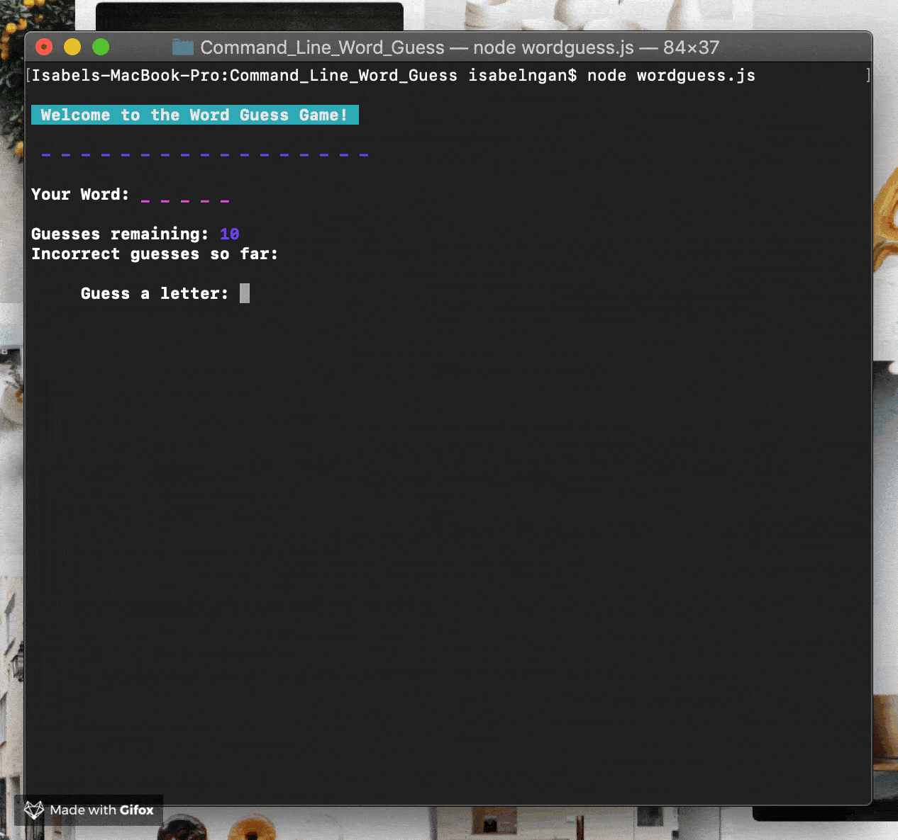

# Command Line Word Guess
Word Guess command-line game using constructor functions

## Bored and want an fun game to run in your terminal/bash?
Type following command to see the Hangman Command-Line game in action.
<li>🤫😏 node wordgueess.js </li> 
<li>An watch the game unfold! </li>




## Installation
You can install and run with NPM. Simply open your terminal and type the following commands:

```
$ git clone https://github.com/ingan274/Command_Line_Word_Guess.git
$ cd Command_Line_Word_Guess
$ npm install
```
Then, start the game with:
```
$ node index.js
```
Alternatively, to install system-wide (so that you don't have to be in the directory to run the app), just run:
```
$ npm link
```
This will make the command Command_Line_Word_Guess available to you anywhere in your terminal! No need cd into this git repo to run the app.

## How To Play
After launching the game, you will see some blanks. Each represents a letter from the random word.
Type a letter to guess if it is in the random word.
Each time you guess an incorrect letter, your "Guesses Remaining" will reduce by 1. Once this reaches zero, you lose!
If you guess the random word before exhausting your guesses remaining, you win!
At the win/loss screen, you may play again by hitting the enter key, or you can exit by typing "n" or "no."

###### Have Fun Guessing!

##### Week 11 assigment for the June 2019 cohort of UCLA Boot Camp. Built using JavaScript, Node, Inquirer.


